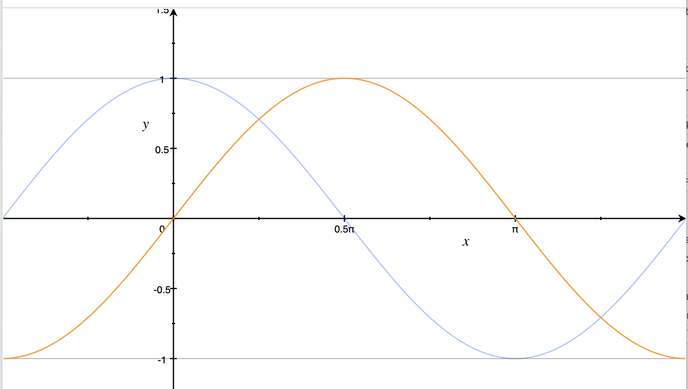

Hi everyone, I’m going to show you how to create this view in SwiftUI. We are
going to focus on the layout of the mini circles.

Before we dive in, I recommend you grab the base code for this example from this
[gist](https://gist.github.com/kayleg/9926c5f8d169fe5789916ee1abc8484e#file-circlelayoutexercise-swift).

First let’s setup a `GeometryReader` in our base view to get the width of our
view and set the dimensions of our background circle. We will need this metric
later on when we are positioning our subviews.

``` swift
GeometryReader { geometry in
  Circle()
  .foregroundColor(.init(hue: 0, saturation: 0.0, brightness: 0.9))
  .frame(width: geometry.size.width, height: geometry.size.width, alignment:
  .center)
  .overlay(
    CircularLayout(
      radius: (geometry.size.width * 0.75) / 2,
      count: Int(self.count))
    .offset(x: geometry.size.width * 0.125, y: geometry.size.width * 0.125)
  )
}
```

Next we will create our `CirclularLayout` with `radius` and `count` properties.
The `count` is just for this simple demo and is the number of subviews to
create.

``` swift
struct CircularLayout : View {
    var radius: CGFloat;
    var count: Int;

    var body: some View {
    }
}
```

Let’s add a `ZStack` to our `CicularLayout` to prevent other auto layout metrics
from conflicting with the positions of our subviews.

``` swift
struct CircularLayout : View {
    var radius: CGFloat;
    var count: Int;

    var body: some View {
      ZStack {
      }
    }
}
```

Now we’ll add a `ForEach` to dynamically generate `count` number of views inside
our `ZStack`.

``` swift
struct CircularLayout : View {
    var radius: CGFloat;
    var count: Int;

    var body: some View {
      ZStack {
        ForEach((0...self.count-1), id: \.self) { index in
          MiniCircle(title: "\(index)")
      }
    }
}
```

Before we start positioning the subviews, here’s a quick refresher on how the
angle relates to the coordinates of a circle.



Our X-Axis is radians and our Y-Axis is units.
With our blue `cos`  curve we see that for a `0 radian` angle, we have a value
of `1` and at `PI` we have a value of `-1`

Similarly,  `sin` is shifted `PI/2 radians` so it is `0`  at `0` and `1` at
`PI/2`

This lets us use `(cos(angle), sin(angle))` as our coordinate for our positioned
subview.

Cool, now let’s get out first view in the correct position.
Start by moving it from (0,0) being top left to being in the center of our
layout `(self.radius, self.radius)` This lets us just work from the Unit Circle
for easy math.

``` swift
struct CircularLayout : View {
    var radius: CGFloat;
    var count: Int;

    var body: some View {
      ZStack {
        ForEach((0...self.count-1), id: \.self) { index in
          MiniCircle(title: "\(index)")
            .position(x: self.radius, y: self.radius)
      }
    }
}
```

Next we will move our subview to the `3 o’clock` position to start by adding
`cos(angle) * self.radius`  to the `x` and `sin(angle) * radius` to the `y`.
We'll workout what this `angle` is next.

``` swift
struct CircularLayout : View {
    var radius: CGFloat;
    var count: Int;

    var body: some View {
      ZStack {
        ForEach((0...self.count-1), id: \.self) { index in
          MiniCircle(title: "\(index)")
            .position(x: self.radius + cos(angle) * self.radius,
                      y: self.radius - sin(angle) * self.radius)
      }
    }
}
```

> Remember that’s the form for a coordinate on a circle; adding or subtracting
> `sin` determines if we go clockwise or counterclockwise). Multiplying by the
> radius converts the Unit Circle to our circles dimensions.

To determine the angle: we know we want the views to be equidistant. So 2 views
should give us an angle of `PI` to split the circle into 2. With 3 views we want
`2PI/3` since there are `2PI` radians in a circle. Here we can see the pattern
is just `2PI/count` to get an equidistant angle.

``` swift
struct CircularLayout : View {
    var radius: CGFloat;
    var count: Int;

    var body: some View {
      let angle = 2.0 / CGFloat(self.count) * .pi
      return ZStack {
        ForEach((0...self.count-1), id: \.self) { index in
          MiniCircle(title: "\(index)")
            .position(x: self.radius + cos(angle) * self.radius,
                      y: self.radius - sin(angle) * self.radius)
      }
    }
}
```

Lastly we just want to multiply our `angle` by the `index` in the loop to apply
a partial rotation around the circle for each subview.

``` swift
struct CircularLayout : View {
    var radius: CGFloat;
    var count: Int;

    var body: some View {
      let angle = 2.0 / CGFloat(self.count) * .pi
      return ZStack {
        ForEach((0...self.count-1), id: \.self) { index in
          MiniCircle(title: "\(index)")
            .position(x: self.radius + cos(angle * CGFloat(index)) * self.radius,
                      y: self.radius - sin(angle * CGFloat(index)) * self.radius)
      }
    }
}
```

If you want to adjust where on the circle your first view is positioned, just
add an offset to the `cos` and `sin` arguments. For example: `cos(angle*index +
PI/2)` and `sin(angle*index + PI/2)` will start at 12 o’clock.

And that’s it for how to build a `CircularLayout`.
